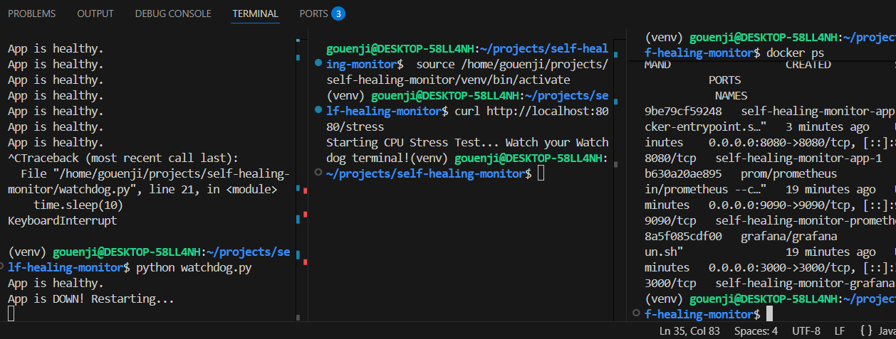

# 🛡️ Autonomous Self-Healing & Performance Gate

A production-grade **Site Reliability Engineering (SRE)** and **SDET** project demonstrating automated service recovery and continuous quality verification. This system ensures high availability by automatically healing crashed services and prevents performance regressions using CI/CD gates.

## 🚀 Key Features
- **Self-Healing:** Python watchdog detects service hangs via Prometheus API and triggers automated Docker restarts.
- **Performance Gate:** Integrated **k6** load testing in GitHub Actions to prevent slow code from reaching production.
- **Observability:** Real-time metrics instrumentation using `prom-client` and visualization via Grafana.
- **Chaos Engineering:** Dedicated `/stress` endpoint to simulate CPU-bound event loop blockage for resilience testing.

## 🛠️ Tech Stack
- **Automation:** Python 3, GitHub Actions, k6 (Performance Testing)
- **Monitoring:** Prometheus (TSDB), Grafana
- **Infrastructure:** Docker, Docker Compose V2
- **Application:** Node.js (Express.js)

## 🏗️ The Control Loop (SRE Logic)
1. **Observe:** Prometheus scrapes `/metrics` from the Node.js app every 5 seconds.
2. **Evaluate:** A background Python Watchdog queries the Prometheus API for the `up` metric.
3. **Act:** If `up == 0` (indicating a hang or crash), the watchdog executes a `docker restart` command.
4. **Verify:** GitHub Actions runs a 10-user load test on every push to ensure 95% of requests stay under 250ms.

## 🧪 How to Test

### 1. Manual Chaos Test (Self-Healing)
* **Trigger a Hang:** Visit `http://localhost:8080/stress`. This triggers an infinite loop that blocks the Node.js event loop.
* **Observation:** The Node.js event loop blocks; Prometheus scrape fails.
* **Recovery:** The Python Watchdog detects the failure and restores the service in <10 seconds.

### 2. Automated Performance Test (SDET)
Verify service stability under load locally:
```bash
k6 run load-test.js

## 📸 Proof of Concept
*(Note: You should insert your screenshot here by naming it 'demo.png' in your folder)*


## 🔧 Setup & Installation
```bash
# 1. Clone the repository
git clone <your-repo-link>

# 2. Spin up the infrastructure
docker-compose up -d

# 3. Setup Python environment
python -m venv venv
source venv/bin/activate  # Or .\venv\Scripts\activate on Windows
pip install requests

# 4. Start the Watchdog
python watchdog.py

## 📈 GitHub Actions Integration
## This repository includes a CI/CD pipeline in .github/workflows/performance.yml. On every push, GitHub:

## Provisions an Ubuntu runner.

## Deploys the Dockerized environment.

## Executes a k6 load test to enforce performance SLAs.